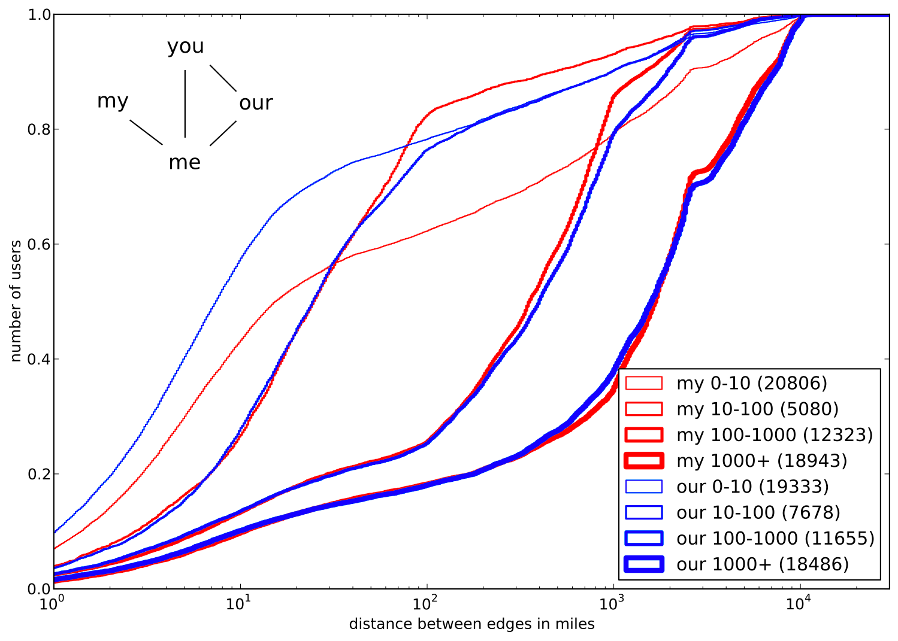

Friendly Location: Location Estimation on Twitter
=================================================

---
The Problem
-----------
* Localized content and services are growing.
* Social network users may provide location information, but it may not be
  high-quality. It might even by nonsense.
* Third party apps may not have access to IP-based geolocation.
* A small percent provides precise location information in geolocated tweets.

---
Prior Work
----------
* Find Me If You Can - Backstrom et al. - Location prediction of Facebook users
  with street addresses
* You Are Where You Tweet - Cheng et al. - Content based prediction of
  Twitter users

---
Greater Houston Area
--------------------

* Breadth-first search of Houstonians and one step out on the social graph.
* Stored tweets, friends, and followers
* Stopped when I ran out of Houstonians
* Confirmed relationships between friendships and distance
* Analyzed social triangles

---
Greater Houston Area Results
----------------------------

---
Greater Houston Area Results
----------------------------

---
Greater Houston Area Problems
------------------------------
* Biased sample - we already know the location
* Not enough geolocated users to evaluate
* Social triangles correlated with follower count

---
The USA
-------
* Took @bde's geolocated tweets
* Found users in the US (the geolocated users)
* Crawled their tweets, friends, and followers (the contacts)
* Crawled tweets, friend ids, and follower ids for contacts
* Analyzed different types of contacts

---
The USA - Basic Edge Types
--------------------------

---
The USA - Effect of Communication
---------------------------------

---
The USA - Social Triangles
--------------------------

---
The USA Problems
----------------
* I wanted to go one step further out on the social graph
* US Geography is unique - the bimodal distribution doesn't exist
* I made a predictor, but it was convoluted

---
The World
---------

* Took @bde's geolocated tweets
* Kept 250,000 users (the geolocated users)
* Crawled their tweets, friends, and followers (the contacts)
* Picked 25 contacts with decodable locations (the neighbors)
* Crawled tweets, friends, and followers for neighbors
* Crawled profiles for friends, followers, and mentions of neighbors (the leafs)

---
The World - Edge Types
----------------------

---
Tree Regressor for Edge Classification
--------------------------------------

Creates a binary tree based on these features:

* friends count
* followers count
* % local friends
* % local followers
* quality of location
* if following
* if friends
* if mentioned

---
Tree Regressor for Edge Classification
--------------------------------------

---
Location Prediction With Maximum Likelihood Estimation
------------------------------------------------------

 
We can calculate the probability of friendship as a function of distance:

These probabilities can be combined using maximum likelihood estimation:

---
Location Prediction Results
---------------------------

---
Questions?
==========
